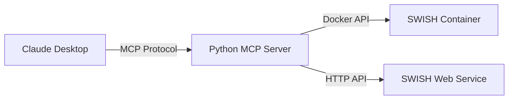

# Docker SWISH MCP Server - Correct Setup Guide

## ⚠️ Common Configuration Error

The error you're experiencing occurs because the configuration is trying to run the Docker SWISH container directly as an MCP server. This is incorrect because:

1. **SWISH** is a Prolog web environment, not an MCP server
2. **MCP Server** is the Python application that manages Docker containers

## 🔧 The Correct Configuration

### ❌ WRONG Configuration
```json
{
  "mcpServers": {
    "docker-swish": {
      "command": "docker",
      "args": ["run", "--rm", "-i", "-v", "./swish-data:/data", "-p", "3050:3050", "swipl/swish"]
    }
  }
}
```
This runs the SWISH container directly, which doesn't understand MCP protocol.

### ✅ CORRECT Configuration
```json
{
  "mcpServers": {
    "docker-swish": {
      "command": "uv",
      "args": [
        "--directory",
        "/home/ty/Repositories/ai_workspace/docker-swish-mcp",
        "run",
        "python",
        "-m",
        "docker_swish_mcp.main"
      ],
      "env": {
        "LOG_LEVEL": "INFO"
      }
    }
  }
}
```
This runs the Python MCP server, which then manages Docker containers.

## 🚀 Quick Setup Instructions

1. **Run the setup script**:
   ```bash
   cd /home/ty/Repositories/ai_workspace/docker-swish-mcp
   ./setup_mcp.sh
   ```

2. **Update Claude Desktop configuration**:
   - Open: `~/.config/claude-desktop/claude_desktop_config.json`
   - Replace the docker-swish configuration with the correct one above
   - Make sure to use the absolute path (not `$(pwd)`)

3. **Restart Claude Desktop**

## 📋 How It Works



1. Claude Desktop communicates with the Python MCP server using the MCP protocol
2. The Python MCP server manages Docker containers and provides tools
3. SWISH runs as a separate Docker container managed by the MCP server

## 🛠️ Available Tools

Once properly configured, you'll have access to:

- `start_swish_container()` - Launch and configure SWISH
- `stop_swish_container()` - Stop the running container
- `get_swish_status()` - Check container and service status
- `execute_prolog_query()` - Run Prolog queries
- `create_prolog_file()` - Create knowledge base files
- `list_prolog_files()` - Browse available files
- `configure_swish_auth()` - Set authentication mode

## 🔍 Troubleshooting

### MCP Timeout Error
If you see `MCP error -32001: Request timed out`:
- You're using the wrong configuration (running Docker directly)
- Solution: Use the Python MCP server configuration

### Permission Errors
If you see UID warnings:
- These are from Docker, not critical
- The MCP server handles permissions properly

### Docker Not Found
- Ensure Docker Desktop is running
- Check: `docker info`

### Python/UV Issues
- Install uv: `curl -LsSf https://astral.sh/uv/install.sh | sh`
- Use Python 3.10+

## 📝 Example Usage

Once properly configured:

```
User: "Start a SWISH container for Prolog programming"
Claude: [Uses start_swish_container() tool]

User: "Create a family tree knowledge base"
Claude: [Uses create_prolog_file() tool]

User: "Run the query: ancestor(tom, X)."
Claude: [Uses execute_prolog_query() tool]
```

## 🎯 Key Points

1. **MCP Server** = Python application (docker_swish_mcp)
2. **SWISH** = Prolog environment (runs in Docker)
3. **Configuration** must point to the Python script, not Docker directly
4. **Tools** are provided by the Python MCP server to manage SWISH

## 📚 Further Reading

- [Model Context Protocol Documentation](https://modelcontextprotocol.io/)
- [SWI-Prolog Documentation](https://www.swi-prolog.org/)
- [Docker SWISH Project](https://github.com/SWI-Prolog/docker-swish)
